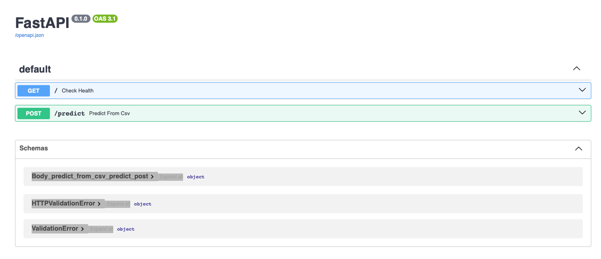

## 1. Overview

This project focuses on building an end-to-end machine learning solution to predict whether a customer is likely to churn from a telecom subscription service. Using the Telco Customer Churn dataset, the pipeline includes data preprocessing, feature engineering, model training, and deployment. The trained model is served via a FastAPI application hosted on **Azure App Service**, making it accessible through a REST API. The entire solution is integrated with **Azure DevOps** to enable automated CI/CD for code updates, testing, and deployment. To ensure observability and reliability in production, the application is instrumented with custom metrics and traces that are visualized in **Grafana**, powered by **Prometheus** and **Jaeger**. This project demonstrates how machine learning models can be effectively operationalized using modern cloud-native tools and DevOps best practices.

## 2. Telco Customer Churn Dataset
The dataset used in this project is the [Telco Customer Churn dataset](https://www.kaggle.com/datasets/blastchar/telco-customer-churn) from Kaggle, originally published by IBM. It contains 7,043 customer records, each with 21 features related to demographics, account information, service subscriptions, and billing. Key attributes include gender, tenure, contract type, internet service, monthly charges, and payment method. The target variable is `Churn`, a binary label indicating whether the customer left the service.

This dataset provides a realistic view of subscription-based service behavior and is widely used for churn prediction modeling. It serves as a valuable foundation for exploring classification algorithms, feature engineering, and end-to-end deployment workflows.

## 3. Architecture


## 4. Implementation:

### 4.1 Setup:

- Clone code from repo:
```
git clone https://github.com/JoshPDang/telcochurnapp.git
```

- Create an virtual environment and install requirements:
```
python -m venv .venv
source .venv/bin/activate
pip install -r requirements.txt
```
- Run the notebook, the model will be save in folder "model"

### 4.2 Deploy the app at local

- Build and run app:

```
docker build --platform linux/amd64 -t churn-prediction-app:latest .
docker run -d --name churn-predict -p 8000:8000 churn-prediction-app
```
- Check if the app running at port 8000:

```
docker ps -a
```


- Access the app at: 127.0.0.1:8000/docs


- Click on Try it out, upload a test csv file and predict:


### 4.3 Deploy app on Azure via Azure Kubernetes Service

- Log in to azure portal using your credentials
```
az login
```

- create azure container registry
``` 
az group create --name churnappRG --location australiaeast
az acr create --resource-group churnappRG --name churnappregistry --sku Basic
```

- log into ACR:

```
az acr login --name churnappregistry
```
- tag local docker image:

```
az acr show --name churnappregistry --query loginServer --output tsv
docker tag churn-prediction-app churnappregistry.azurecr.io/churn-prediction-app:latest
```
- push the tagged image to ACR:

```
docker push churnappregistry.azurecr.io/churn-prediction-app:latest
```
- create AKS cluster and attach ACR:

```
az aks create \
  --resource-group churnappRG \
  --name churnappAKS \
  --node-count 1 \
  --enable-addons monitoring \
  --generate-ssh-keys \
  --attach-acr churnappregistry
```

- get AKS credential:
```
az aks get-credentials \
  --resource-group churnappRG \
  --name churnappAKS
```
- Apply Kubernetes manifest:

```
kubectl apply -f k8s/deployment.yaml
kubectl apply -f k8s/service.yaml
```
- We can check if pods running:

```
kubectl get pods
```

- Get the Service IP:

```
kubectl get svc churn-predict-service
```


### 4.4 Deploy Monitoring system:

- Add Helm repos:
```
helm repo add prometheus-community https://prometheus-community.github.io/helm-charts
helm repo add grafana https://grafana.github.io/helm-charts
helm repo update
```

- Install Prometheus stack:
```
helm install monitoring prometheus-community/kube-prometheus-stack
```
- Check if service installed:
```
kubectl get svc -n default
```

- Expose Grafana:
```
kubectl port-forward svc/monitoring-grafana 3000:80
```

## CI/CD:
- create new project in Azure Devops:
- create a new connection to your resources
- create a new repo, and push your code